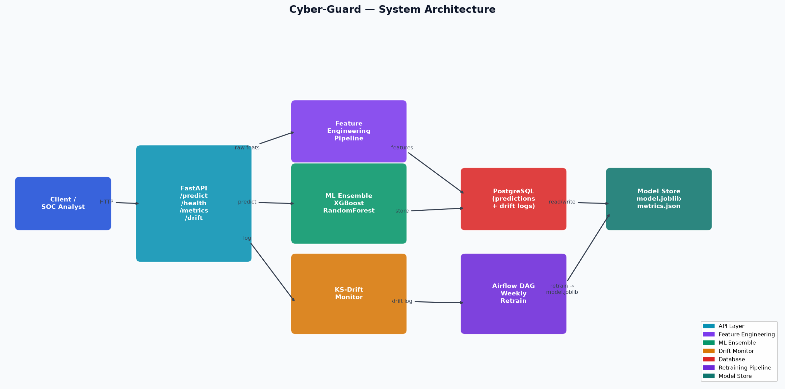

# Cyber-Guard

[](https://github.com/atharvadevne123/reflective-lantern/actions/workflows/ci.yml)
[](https://python.org)
[](https://fastapi.tiangolo.com)
[](LICENSE)

**Real-time network intrusion detection and cybersecurity threat classification API** using an XGBoost + RandomForest ensemble with KS-test drift monitoring, automated weekly retraining via Airflow, and full PostgreSQL persistence.

## Overview

Cyber-Guard classifies network connections into five threat categories:

| Class | Description |
|-------|-------------|
| `normal` | Legitimate traffic |
| `dos` | Denial-of-service attack |
| `probe` | Network reconnaissance / port scan |
| `r2l` | Remote-to-local unauthorized access |
| `u2r` | User-to-root privilege escalation |

## Architecture



## Tech Stack

- **API**: FastAPI with correlation-ID and rate-limit middleware, Pydantic v2 validation
- **ML**: XGBoost + RandomForest VotingClassifier (soft voting), 5-fold stratified CV
- **Features**: 15 engineered features — byte ratios, log transforms, rolling stats, protocol encodings
- **Anomaly detection**: IsolationForest over the same feature space, for traffic
  that matches none of the five known classes
- **Monitoring**: SciPy KS-test drift detection on the `src_bytes` distribution
- **Storage**: SQLAlchemy (SQLite dev / PostgreSQL prod), Alembic migrations
- **Retraining**: Airflow DAG scheduled weekly, configurable accuracy gate
- **Tracking**: optional MLflow runs and optional S3 artifact storage — both
  degrade to no-ops when unconfigured
- **Infra**: Docker + docker-compose, GitHub Actions CI (ruff + pytest)

### Measured performance

Five-fold stratified cross-validation on 600 generated connections:

| Metric | Value |
|--------|-------|
| Accuracy | 0.960 ± 0.021 |
| AUC-ROC (weighted OvR) | 0.997 ± 0.002 |

The generator in `app.model` samples packet fields *conditional on* the threat
class, so the task is genuinely learnable. Sampling features and labels
independently — the obvious way to write such a generator — caps AUC at ~0.5
no matter how good the model is.

## Quick Start

```bash
# 1. Clone & configure
git clone https://github.com/atharvadevne123/reflective-lantern.git
cd reflective-lantern/Cyber-Guard
cp .env.example .env

# 2. Install dependencies
pip install -r requirements.txt

# 3. Run locally (SQLite)
DATABASE_URL=sqlite:///./cyber_guard.db uvicorn app.main:app --reload

# 4. Or run with Docker (PostgreSQL)
docker-compose up --build
```

## API Reference

### POST /api/v1/predict

Classify a network connection.

**Request:**
```json
{
  "src_bytes": 491,
  "dst_bytes": 0,
  "duration": 0.0,
  "protocol_type": "tcp",
  "service": "http",
  "flag": "SF"
}
```

**Response:**
```json
{
  "prediction": "normal",
  "confidence": 0.9241,
  "class_probabilities": {
    "normal": 0.9241,
    "dos": 0.0312,
    "probe": 0.0218,
    "r2l": 0.0154,
    "u2r": 0.0075
  }
}
```

### GET /api/v1/health

Returns API and model status.

### GET /api/v1/metrics?hours=24&run_drift=false

Returns prediction statistics and optional drift check.

### POST /api/v1/anomaly

Scores a connection for outlier-ness without assigning a threat class. A novel
attack looks like an inlier to a classifier forced to pick one of five labels,
but like an outlier here.

```json
{ "anomaly_score": 0.1497, "decision_score": -0.1497, "is_anomaly": true }
```

### GET /api/v1/drift

Runs a KS-test drift check on the `src_bytes` distribution, comparing the last
24 hours against everything older than `REFERENCE_WINDOW_DAYS`.

To see it fire on a fresh database:

```bash
make seed-drift          # backfill both windows with a 10x volume shift
curl localhost:8000/api/v1/drift
# {"ks_statistic":0.9475,"p_value":0.0,"drift_detected":true}
```

### Rate limiting

All endpoints except `/api/v1/health` are limited to `RATE_LIMIT_PER_MINUTE`
requests per caller per 60s sliding window, and respond with `429` plus a
`Retry-After` header when exceeded. Health is exempt so that a liveness probe
can never rate-limit the service out of its own cluster.

## Environment Variables

See [.env.example](.env.example) for all variables.

| Variable | Default | Description |
|----------|---------|-------------|
| `DATABASE_URL` | `sqlite:///./cyber_guard.db` | DB connection string |
| `MODEL_PATH` | `model.joblib` | Path to serialised model |
| `DRIFT_P_THRESHOLD` | `0.05` | KS-test p-value threshold |
| `REFERENCE_WINDOW_DAYS` | `7` | Days of history for reference distribution |
| `RATE_LIMIT_PER_MINUTE` | `120` | Per-caller request limit |
| `RETRAIN_ACCURACY_FLOOR` | `0.70` | Below this, a retrained model is not promoted |
| `MLFLOW_TRACKING_URI` | *(empty)* | Empty disables MLflow tracking |
| `S3_BUCKET` | *(empty)* | Empty keeps model artifacts local |

## Database Migrations

```bash
make migrate        # alembic upgrade head
make migrate-down   # roll back one revision
```

Alembic reads `DATABASE_URL` from the same environment variable the app does,
so migrations can never run against a different database than the service.

## Running Tests

```bash
cd Cyber-Guard
make test           # 100 tests
make lint           # ruff, must exit 0
```

## Feature Engineering

Fifteen features are derived from six raw packet fields:

- **Categorical encodings**: protocol, service, flag (label-encoded)
- **Ratio features**: `byte_ratio`, `total_bytes`, `src_dst_diff`
- **Log transforms**: `log_src_bytes`, `log_dst_bytes`, `log_duration`
- **Interaction features**: `bytes_per_second`
- **Rolling statistics**: 5-connection rolling mean and std of `src_bytes`

### A note on train/serve skew

The model is fitted on batches but served one connection at a time. Computing
a rolling window over a one-row frame yields `mean == src_bytes` and
`std == 0` — not a noisy estimate but a systematically wrong one, and it put
*every* served request off the training manifold (the anomaly detector flagged
100% of traffic as a result).

`NetworkFeatureEngineer` therefore learns the training averages of those two
columns at `fit` time and imputes them whenever the frame is shorter than the
window. `tests/test_train_serve_parity.py` pins the invariant that scoring a
row alone agrees with scoring it inside a batch.

## Model Retraining

The Airflow DAG (`pipelines/retrain_dag.py`) runs weekly and:
1. Fetches the last 7 days of prediction logs
2. Retrains the ensemble model
3. Validates accuracy against `RETRAIN_ACCURACY_FLOOR` (default 0.70), raising
   and leaving the previous model in place if the new one is worse

The gate fails closed: a metrics file missing an accuracy figure is treated as
zero rather than passing.

## Contributing

See [CONTRIBUTING.md](CONTRIBUTING.md).
