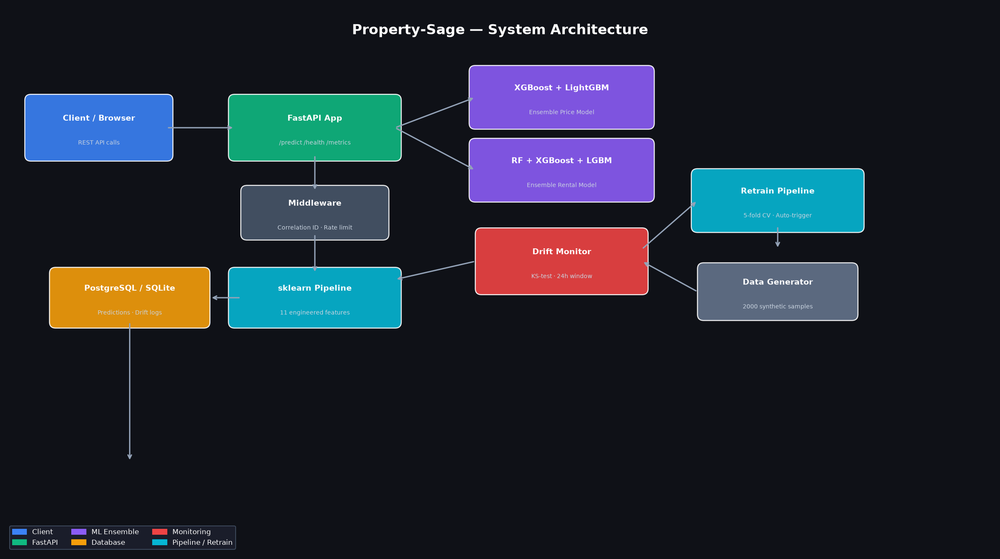

# Property-Sage

[](https://github.com/atharvadevne123/reflective-lantern/actions)
[](https://python.org)
[](https://fastapi.tiangolo.com)
[](LICENSE)

> Real estate property valuation and rental yield prediction API using an XGBoost–LightGBM–RandomForest ensemble with automated drift detection and retraining.

---

## Overview

**Property-Sage** is a production-ready machine learning service that predicts:

- **Property market value** — absolute sale price estimate
- **Rental yield** — annualised gross rental return as a fraction of market value

It processes 11 engineered features derived from basic property attributes and returns predictions in milliseconds via a versioned REST API.

### Key capabilities

| Capability | Detail |
|---|---|
| Ensemble ML | XGBoost + LightGBM + RandomForest (weighted 40/40/20) |
| Feature engineering | 11 features: age², sqft/bed ratio, lot density, neighbourhood index |
| Model monitoring | KS-test drift detection on a 24-hour rolling window |
| Automated retraining | Triggered when p-value < 0.05 on any monitored feature |
| Persistence | SQLite (dev) / PostgreSQL (prod) via SQLAlchemy |
| Containerised | Docker + docker-compose one-command setup |
| CI | GitHub Actions: ruff lint + pytest on every push |



---

## Setup

### Prerequisites

- Python 3.11+
- Docker & docker-compose (for production mode)

### Local development

```bash
cd Property-Sage
pip install -r requirements.txt

# Copy and edit environment
cp .env.example .env

# Run the API (SQLite in dev)
DATABASE_URL=sqlite:///./property_sage.db uvicorn app.main:app --reload

# Run tests
pytest tests/ -v
```

### Docker (production)

```bash
cd Property-Sage
docker-compose up --build
```

The API is available at `http://localhost:8000`.

---

## API Reference

All endpoints are versioned under `/api/v1/`.

### `POST /api/v1/predict`

Predict property valuation and rental yield.

**Request body**

```json
{
  "bedrooms": 3,
  "bathrooms": 2.0,
  "sqft": 1500,
  "lot_size": 6000,
  "year_built": 2005,
  "neighborhood": "suburb",
  "property_type": "house"
}
```

**Valid neighborhoods:** `downtown`, `suburb`, `midtown`, `uptown`, `waterfront`, `historic`, `industrial`, `university`, `airport`, `rural`

**Valid property types:** `apartment`, `house`, `condo`, `townhouse`, `studio`

**Response**

```json
{
  "request_id": "b3f1c...",
  "predicted_price": 452300.50,
  "predicted_rental_yield": 0.0521,
  "estimated_annual_rental": 23565.00,
  "estimated_monthly_rental": 1963.75,
  "neighborhood": "suburb",
  "property_type": "house"
}
```

### `GET /api/v1/health`

Service liveness check.

### `GET /api/v1/metrics`

Returns model performance metrics (R², RMSE, MAE) and prediction statistics for the last 24 hours.

### `POST /api/v1/drift-check`

Runs a KS-test on predictions from the last 24 hours against the reference distribution. Returns per-feature drift results.

---

## Architecture

Property-Sage follows a layered architecture:

```
Client → FastAPI (Middleware: Correlation ID, Rate Limit)
       → Feature Pipeline (11 features, sklearn Pipeline)
       → Ensemble Model (XGBoost + LightGBM + RF)
       → Response

Background:
  Prediction Log → PostgreSQL
  Monitoring     → KS-test drift detection
  Retrain DAG    → Triggered on drift, 5-fold CV
```

See `scripts/generate_diagram.py` to regenerate `screenshots/architecture.png`.

---

## Contributing

See [CONTRIBUTING.md](CONTRIBUTING.md).

## Changelog

See [CHANGELOG.md](CHANGELOG.md).
