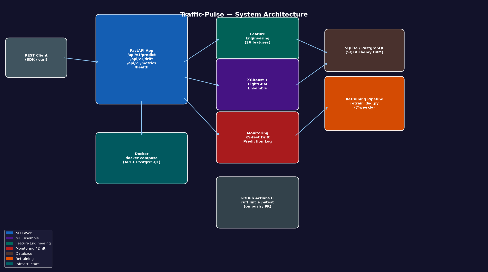

# Volt-Cast ⚡

[](https://github.com/atharvadevne123/reflective-lantern/actions/workflows/ci.yml)
[](https://www.python.org/downloads/)
[](https://fastapi.tiangolo.com)
[](LICENSE)

> **Electricity consumption and grid load prediction API** using XGBoost-LightGBM-RandomForest VotingRegressor ensemble with KS-test drift monitoring, automated weekly retraining, and production-grade smart energy management.

---

## Overview

Volt-Cast is a production-quality ML API for **smart grid energy load forecasting**. It takes temporal and environmental features (hour, day, temperature, humidity, historical loads) and predicts electricity demand in megawatts for a given time slot.

### Key Features

- **Ensemble Model**: XGBoost + LightGBM + RandomForest `VotingRegressor` with 5-fold cross-validation
- **6-Stage Feature Pipeline**: Lag (1h/24h/168h), Rolling stats, Temporal cyclical, Peak period encoding, Heat index ratios, Drop + StandardScaler
- **KS-Test Drift Detection**: Kolmogorov-Smirnov test across prediction distribution windows
- **7 REST Endpoints**: `/predict`, `/batch-predict`, `/forecast`, `/drift`, `/retrain`, `/health`, `/metrics`
- **Automated Retraining**: Airflow DAG scheduled weekly with R² gate (≥0.60)
- **Production Infra**: Docker + PostgreSQL + SQLAlchemy ORM + Alembic migrations
- **Rate Limiting**: 200 req/min per IP with correlation ID middleware

---

## Architecture



---

## Quick Start

### Local Development

```bash
# Install dependencies
pip install -r requirements.txt

# Run the API
uvicorn app.main:app --reload

# Test
pytest tests/ -v
```

### Docker

```bash
cp .env.example .env
docker-compose up --build
```

The API will be available at `http://localhost:8000`. Interactive docs at `http://localhost:8000/docs`.

---

## API Reference

### POST `/api/v1/predict`

Predict energy load for a single time slot.

```json
{
  "hour": 14,
  "day_of_week": 2,
  "month": 7,
  "is_weekend": false,
  "temperature_c": 28.5,
  "humidity_pct": 65.0,
  "historical_loads": [3500.0, 3600.0, 3800.0, 4000.0],
  "region": "northeast"
}
```

**Response:**
```json
{
  "predicted_load_mw": 4312.75,
  "model_version": "1.0.0",
  "region": "northeast",
  "request_id": "550e8400-e29b-41d4-a716-446655440000",
  "latency_ms": 8.4
}
```

### POST `/api/v1/batch-predict`

Predict for multiple time slots (up to 100).

### GET `/api/v1/forecast?start_hour=8&day_of_week=0&month=6&horizon_hours=24`

Multi-hour load forecast for grid planning.

### GET `/api/v1/drift`

KS-test drift report for the recent prediction distribution.

### GET `/api/v1/metrics`

Model performance metrics: R², RMSE, prediction count, P50/P95 latency.

### POST `/api/v1/retrain`

Trigger model retraining on fresh data.

### GET `/api/v1/health`

Health check with model load status and uptime.

---

## Feature Engineering

| Stage | Transformer | Features Added |
|-------|-------------|----------------|
| 1 | `LagFeatureTransformer` | `lag_1h`, `lag_24h`, `lag_168h` |
| 2 | `RollingStatsTransformer` | `rolling_mean_3h`, `rolling_std_3h`, `rolling_mean_24h`, `rolling_std_24h` |
| 3 | `TemporalFeatureTransformer` | `hour_sin`, `hour_cos`, `dow_sin`, `dow_cos`, `month_sin`, `month_cos` |
| 4 | `PeakPeriodEncoder` | `is_peak_hour`, `is_morning_peak`, `is_evening_peak`, `is_weekday_peak` |
| 5 | `RatioFeatureTransformer` | `heat_index`, `cooling_demand_proxy`, `heating_demand_proxy`, `load_ratio_vs_daily_mean` |
| 6 | `StandardScaler` | Normalized numeric features |

---

## Project Structure

```
volt-cast/
├── app/
│   ├── __init__.py         # Package init
│   ├── database.py         # SQLAlchemy models
│   ├── features.py         # 6-stage feature pipeline
│   ├── main.py             # FastAPI app (7 endpoints)
│   ├── middleware.py       # Rate limiting + correlation ID
│   ├── model.py            # Ensemble training & prediction
│   ├── monitoring.py       # KS-drift detection
│   └── schemas.py          # Pydantic request/response models
├── pipelines/
│   └── retrain_dag.py      # Airflow weekly retraining DAG
├── tests/
│   ├── conftest.py         # Pytest fixtures
│   ├── test_api.py         # API endpoint tests
│   ├── test_database.py    # ORM model tests
│   ├── test_features.py    # Feature pipeline tests
│   ├── test_model.py       # Model training tests
│   └── test_monitoring.py  # Drift detection tests
├── scripts/
│   └── generate_diagram.py # Architecture diagram
├── screenshots/
│   └── architecture.png    # System architecture diagram
├── .github/workflows/ci.yml
├── Dockerfile
├── docker-compose.yml
├── requirements.txt
├── pyproject.toml
├── Makefile
└── .env.example
```

---

## Tech Stack

| Category | Technology |
|----------|-----------|
| Language | Python 3.11 |
| API Framework | FastAPI 0.111+ |
| ML Models | XGBoost, LightGBM, RandomForest |
| Ensemble | `VotingRegressor` (scikit-learn) |
| Feature Engineering | Custom sklearn Transformers |
| Drift Detection | KS-test (scipy.stats) |
| Database | SQLAlchemy ORM + PostgreSQL (prod) / SQLite (dev) |
| Pipeline Orchestration | Apache Airflow |
| Containerization | Docker + docker-compose |
| Testing | pytest with parametrized test cases |
| CI/CD | GitHub Actions (ruff lint + pytest) |

---

## License

MIT License — see [LICENSE](LICENSE) for details.
