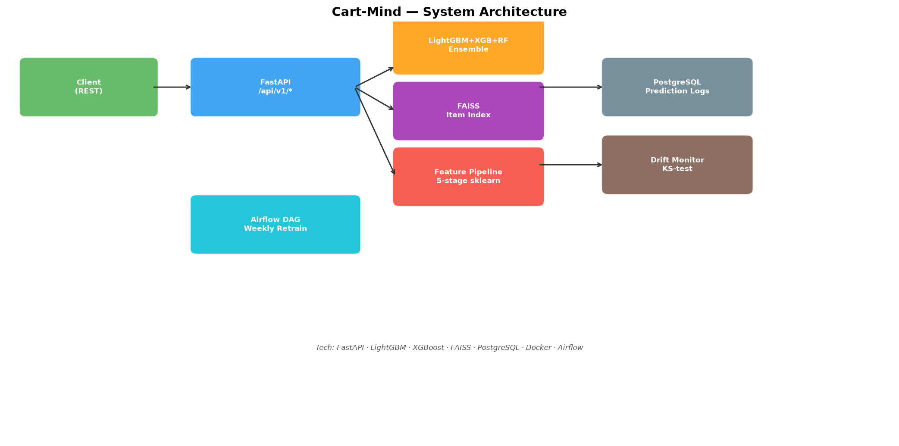

# Cart-Mind

[](https://github.com/atharvadevne123/reflective-lantern/actions)
[](https://www.python.org/downloads/)
[](LICENSE)

Real-time product recommendation and purchase intent prediction API. Ranks candidate items
for a shopper with a LightGBM + XGBoost + RandomForest soft-voting ensemble, finds
look-alike products through a FAISS nearest-neighbour index, and watches its own inputs
for distribution drift with a KS-test monitor that feeds an automated retraining pipeline.



---

## What it does

Given a shopper and an item, Cart-Mind answers three questions:

| Question | Endpoint | Method |
|---|---|---|
| Will this user buy this item? | `POST /api/v1/predict` | Soft-voting ensemble over 29 engineered features |
| What should we show this user? | `POST /api/v1/recommend` | Candidate generation + intent-ranked top-K |
| What else is like this item? | `POST /api/v1/similar` | FAISS L2 nearest neighbours over item embeddings |

Every prediction is logged to PostgreSQL with a correlation ID and latency, so the drift
monitor and the weekly retraining DAG have a real feedback loop to work from.

---

## Setup

### Local (SQLite)

```bash
git clone https://github.com/atharvadevne123/reflective-lantern
cd reflective-lantern/cart-mind
pip install -r requirements.txt
cp .env.example .env
uvicorn app.main:app --reload
```

Train the model and build the item index (optional — the API bootstraps its own model on
first boot if these artifacts are missing):

```bash
python -m scripts.train
```

```
INFO Positive rate: 0.546
INFO Training ensemble with 5-fold stratified CV...
INFO Model trained: AUC=0.7169±0.0187
INFO FAISS index built: 500 items, dim=32
```

The API comes up on `http://localhost:8000`. Interactive docs: `http://localhost:8000/docs`.

### Docker (PostgreSQL)

```bash
docker compose up --build
```

Brings up the API on `:8000` and PostgreSQL on `:5432`, with a healthcheck gate so the API
waits for the database.

### Make targets

```bash
make install    # pip install -r requirements.txt
make test       # pytest
make lint       # ruff check .
make format     # ruff format .
make run        # uvicorn with reload
make build      # wheel + sdist
```

---

## API reference

All endpoints are versioned under `/api/v1`. Every response carries an
`X-Correlation-ID` header, echoed in the JSON body, for request tracing.

### `POST /api/v1/predict`

Predict the probability that a user purchases a specific item.

```bash
curl -X POST http://localhost:8000/api/v1/predict \
  -H "Content-Type: application/json" \
  -d '{
    "user_id": "u_001",
    "item_id": "i_abc",
    "user_age": 35,
    "purchase_count": 12,
    "avg_order_value": 120.0,
    "days_since_last_purchase": 14,
    "days_since_registration": 365,
    "session_count_7d": 8,
    "cart_abandon_rate": 0.2,
    "item_price": 49.99,
    "item_avg_rating": 4.2,
    "item_review_count": 320,
    "item_inventory_level": 85,
    "item_discount_pct": 10.0,
    "view_count": 5,
    "click_count": 2,
    "wishlist_flag": 1,
    "same_category_purchases": 4
  }'
```

```json
{
  "user_id": "u_001",
  "item_id": "i_abc",
  "purchase_probability": 0.7312,
  "will_purchase": true,
  "confidence": "medium",
  "model_version": "1.0.0",
  "correlation_id": "3f2a…"
}
```

`confidence` is `high` when the probability is decisive (`>0.75` or `<0.25`) and `medium`
in the uncertain band between.

### `POST /api/v1/recommend`

Generate top-K recommendations for a user. Candidates are drawn from the catalogue
(3× oversampled), scored by the intent ensemble, and returned rank-ordered.

```bash
curl -X POST http://localhost:8000/api/v1/recommend \
  -H "Content-Type: application/json" \
  -d '{"user_id": "u_001", "purchase_count": 12, "avg_order_value": 120.0, "top_k": 5}'
```

```json
{
  "user_id": "u_001",
  "recommendations": [
    {"rank": 1, "item_id": "item_0142", "score": 0.8821},
    {"rank": 2, "item_id": "item_0007", "score": 0.8104}
  ],
  "count": 5,
  "correlation_id": "9c1b…"
}
```

### `POST /api/v1/similar`

FAISS nearest-neighbour lookup over item embeddings. Falls back to a brute-force
cosine index when `faiss-cpu` is unavailable, so the endpoint never hard-fails.

```bash
curl -X POST http://localhost:8000/api/v1/similar \
  -H "Content-Type: application/json" \
  -d '{"item_id": "i_abc", "top_k": 5}'
```

### `POST /api/v1/drift`

Run a KS-test on supplied feature distributions against the rolling reference window.
Results are persisted to `drift_logs`.

```bash
curl -X POST http://localhost:8000/api/v1/drift \
  -H "Content-Type: application/json" \
  -d '{"feature_values": {"item_price": [12.0, 45.0, "…"]}}'
```

```json
{
  "results": {"item_price": {"ks_statistic": 0.184, "p_value": 0.0031, "drift_detected": true}},
  "drifted_features": ["item_price"],
  "total_checked": 1
}
```

Windows with fewer than 20 observations return `drift_detected: false` with
`reason: "insufficient_data"` rather than a spurious verdict.

### `GET /api/v1/health`

Liveness and readiness — reports whether the model and FAISS index are loaded.

### `GET /api/v1/metrics`

Request counters, drift-alert count, error count, and p50/p95/p99 latency over a
rolling 1000-request window.

---

## Architecture

```
Client
  │
  ▼
FastAPI  ──  RateLimit (200/min/IP)  ──  CorrelationID  ──  GZip
  │
  ├──▶ Feature Pipeline (5-stage sklearn)
  │       ratios → interactions → lag/rolling → discount encoding → scaler
  │
  ├──▶ Ensemble (soft voting)
  │       LightGBM (200 trees) + XGBoost (150 trees) + RandomForest (100 trees)
  │
  ├──▶ FAISS IndexFlatL2  (brute-force fallback)
  │
  └──▶ PostgreSQL
          prediction_logs · drift_logs · user_profiles · item_catalog
                    │
                    ▼
          KS-test drift monitor  ──▶  Airflow weekly DAG
                                        drift_report → retrain_champion
```

### Feature engineering

29 features from 16 raw inputs across five pipeline stages:

| Stage | Features produced |
|---|---|
| `RatioFeatures` | `price_per_rating`, `value_score`, `engagement_rate`, `purchase_intensity`, `spend_per_purchase` |
| `InteractionFeatures` | `affinity_score`, `recency_weight` (30-day exponential decay), `price_sensitivity` |
| `LagRollingFeatures` | `session_norm`, `order_value_norm`, `purchase_velocity` — normalised against training-set means fitted in `fit()` |
| `DiscountEncoder` | `discount_bucket` (5 bins), `inventory_pressure` (scarcity flag) |
| `StandardScaler` | zero-mean, unit-variance across all columns |

### Model

Soft-voting `VotingClassifier` over three gradient-boosted and bagged learners, wrapped in
a single sklearn `Pipeline` with the feature stages so training and serving share one
transform path. Evaluated with 5-fold `StratifiedKFold` CV on AUC-ROC; metrics are written
to `metrics.json` alongside the serialised model.

**Measured performance** — 5-fold stratified CV on 5,000 synthetic interactions:

| Metric | Value |
|---|---|
| AUC-ROC (mean) | **0.717** |
| AUC-ROC (std) | 0.019 |
| Samples | 5,000 |
| Positive rate | 0.546 |

A note on the data: this repository ships no proprietary retail dataset, so training rows
come from `make_sample_dataframe` and labels from `make_purchase_labels`, which draws
outcomes from a logistic transform of a latent propensity score built out of the
behavioural drivers that genuinely move conversion (clicks, wishlist intent, category
affinity, recency, discount depth, price friction). Gaussian noise keeps the problem
non-separable, so 0.717 reflects a model learning a real but imperfect signal rather than
a number inflated by a trivially separable target. Swap in real interaction logs and the
pipeline, gates, and monitoring all carry over unchanged.

### Drift detection

Two-sample Kolmogorov–Smirnov test against a thread-safe rolling reference window
(500 observations per feature, `collections.deque`). `p < 0.05` flags drift; every check is
written to `drift_logs` with the KS statistic and window size.

### Retraining

Airflow DAG `cart_mind_weekly_retrain` runs Mondays at 02:00 UTC:
`drift_report` → `retrain_champion`. The challenger is promoted only if it clears both the
absolute AUC gate (`RETRAIN_AUC_GATE`, default 0.70) and the incumbent champion's AUC.
Runs on fewer than `RETRAIN_MIN_ROWS` (default 500) rows are skipped rather than trained on
thin data. The module imports cleanly without Airflow installed — the task callables are
plain functions.

---

## Testing

```bash
make test
```

60+ tests across four modules: endpoint contracts and validation (`test_api.py`), training
and FAISS search (`test_model.py`), per-transformer feature assertions (`test_features.py`),
and drift/logging/counters (`test_monitoring.py`). Tests run against an isolated SQLite
database via a `get_db` dependency override — no external services required.

## CI

GitHub Actions on every push and PR: `ruff check` → `ruff format --check` → `pytest` →
wheel build, across Python 3.11 and 3.12.

## Configuration

| Variable | Default | Purpose |
|---|---|---|
| `DATABASE_URL` | `sqlite:///./cart_mind.db` | SQLAlchemy connection string |
| `MODEL_PATH` | `model.joblib` | Serialised pipeline location |
| `METRICS_PATH` | `metrics.json` | CV metrics output |
| `FAISS_INDEX_PATH` | `faiss_index.idx` | FAISS index location |
| `ITEM_IDS_PATH` | `item_ids.json` | Index position → item ID mapping |
| `RETRAIN_AUC_GATE` | `0.70` | Minimum AUC for challenger promotion |
| `RETRAIN_MIN_ROWS` | `500` | Minimum rows required to retrain |

---

## Tech stack

Python 3.11 · FastAPI · Pydantic v2 · LightGBM · XGBoost · scikit-learn · FAISS ·
SQLAlchemy 2.0 · Alembic · PostgreSQL · Docker · Airflow · pytest · ruff · GitHub Actions

## License

MIT
