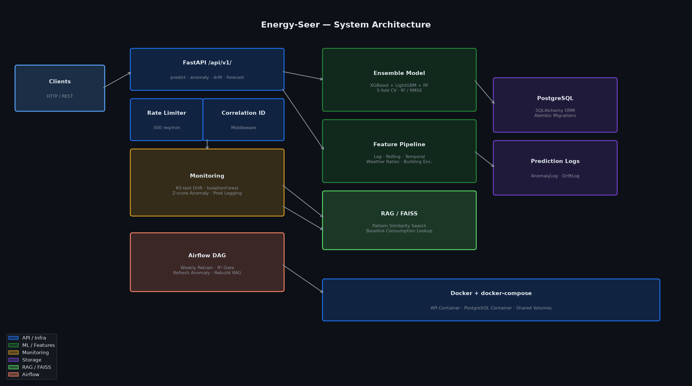

# Energy-Seer

[](https://github.com/atharvadevne123/reflective-lantern/actions)
[](https://python.org)
[](https://fastapi.tiangolo.com)
[](LICENSE)

> Production ML API for energy consumption forecasting and smart grid anomaly detection using XGBoost-LightGBM ensemble with time-series features and KS-drift monitoring.

## Overview

Energy-Seer predicts hourly energy consumption for smart meters, detects grid anomalies in real-time, and monitors model drift to ensure reliable forecasts. It uses a soft-voting ensemble of XGBoost, LightGBM, and RandomForest with a 7-stage feature engineering pipeline including lag features, rolling statistics, cyclical temporal encodings, and weather-based degree-day ratios.

### Architecture



## Features

- **Ensemble Forecasting** — XGBoost + LightGBM + RandomForest VotingRegressor with 5-fold CV
- **Anomaly Detection** — IsolationForest + Z-score with severity classification (low/medium/high/critical)
- **Drift Monitoring** — KS-test per feature with configurable p-value threshold
- **Multi-step Forecast** — Up to 168-hour (7-day) horizon auto-stepping
- **RAG Pattern Search** — FAISS-based similar consumption pattern retrieval
- **Airflow DAG** — Weekly automated retraining with R² validation gate
- **Rate Limiting** — 300 requests/minute per IP with correlation ID tracing

## Quick Start

```bash
git clone https://github.com/atharvadevne123/reflective-lantern
cd reflective-lantern/energy_seer
pip install -r requirements.txt
cp .env.example .env
uvicorn app.main:app --reload
```

Open http://localhost:8000/docs for the interactive API documentation.

### Docker

```bash
docker-compose up --build
```

## API Reference

| Method | Endpoint | Description |
|--------|----------|-------------|
| GET | `/api/v1/health` | API and model health check |
| GET | `/api/v1/metrics` | Model performance metrics |
| POST | `/api/v1/predict` | Single/batch consumption forecast |
| POST | `/api/v1/batch-predict` | Optimised batch prediction |
| POST | `/api/v1/anomaly` | Anomaly detection for a reading |
| POST | `/api/v1/forecast` | Multi-step hourly forecast |
| POST | `/api/v1/drift` | KS-test feature drift check |
| POST | `/api/v1/retrain` | Trigger model retraining |

### Example: Predict

```bash
curl -X POST http://localhost:8000/api/v1/predict \
  -H "Content-Type: application/json" \
  -d '{
    "readings": [{
      "meter_id": "meter_001",
      "consumption_kwh": 4.5,
      "temperature_c": 22.0,
      "humidity_pct": 55.0,
      "hour_of_day": 14,
      "day_of_week": 2,
      "is_holiday": false,
      "building_type": "residential"
    }],
    "horizon_h": 1
  }'
```

### Example: Anomaly Detection

```bash
curl -X POST http://localhost:8000/api/v1/anomaly \
  -H "Content-Type: application/json" \
  -d '{"meter_id": "meter_001", "consumption_kwh": 95.0}'
```

## Feature Pipeline

| Stage | Transformer | Features Generated |
|-------|------------|-------------------|
| 1 | LagFeature | `consumption_lag_1h` to `lag_24h` |
| 2 | RollingStats | `rolling_mean/std/max` (3h, 6h, 12h, 24h) |
| 3 | Temporal | `hour_sin/cos`, `day_sin/cos`, peak flags, weekend |
| 4 | WeatherRatio | `cooling_degree`, `heating_degree`, `discomfort_index` |
| 5 | BuildingEncoder | `building_intensity` (1.0–8.0 scale) |
| 6 | DropRaw | Removes `meter_id`, `timestamp`, `consumption_kwh` |
| 7 | StandardScaler | Zero-mean unit-variance normalisation |

## Tech Stack

- **Python 3.11** · **FastAPI** · **XGBoost** · **LightGBM** · **scikit-learn**
- **FAISS** · **SQLAlchemy** · **PostgreSQL** · **Alembic**
- **Docker** · **Airflow** · **pytest** · **GitHub Actions** · **ruff**

## Running Tests

```bash
make test
# or
pytest tests/ -v --tb=short
```

## Environment Variables

See `.env.example` for all configurable variables.

## License

MIT — see [LICENSE](LICENSE).
