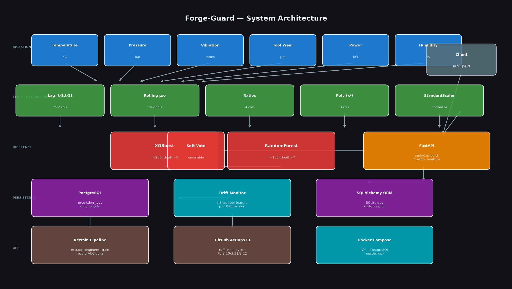

# Forge-Guard

[](https://github.com/atharvadevne123/reflective-lantern/actions/workflows/ci.yml)
[](https://python.org)
[](https://fastapi.tiangolo.com)
[](https://xgboost.ai)
[](LICENSE)

**Real-time manufacturing process quality prediction and defect detection API.**

Forge-Guard ingests 7 sensor readings per production cycle (temperature, pressure,
vibration, cycle time, tool wear, power consumption, humidity) and returns a
defect probability with sub-50 ms latency.  A KS-test drift monitor watches for
distribution shift and triggers automated retraining when needed.

---

## Architecture



---

## Tech Stack

| Layer | Technology |
|---|---|
| API | FastAPI 0.115 + uvicorn |
| Model | XGBoost + RandomForest soft-vote ensemble |
| Features | sklearn Pipeline (lag, rolling, ratio, polynomial, scaler) |
| Monitoring | KS-test drift detection per feature |
| Database | SQLite (dev) / PostgreSQL 16 (prod) via SQLAlchemy 2 |
| Containers | Docker + docker-compose |
| CI | GitHub Actions — ruff lint + pytest (3.10/3.11/3.12) |

---

## Quick Start

### Local (SQLite)

```bash
git clone https://github.com/atharvadevne123/reflective-lantern
cd reflective-lantern/forge-guard
pip install -r requirements.txt
cp .env.example .env
uvicorn app.main:app --reload
```

Open [http://localhost:8000/docs](http://localhost:8000/docs) for the interactive API docs.

### Docker (PostgreSQL)

```bash
cd forge-guard
docker-compose up --build -d
```

---

## API Reference

### `POST /api/v1/predict`

Predict whether a manufacturing cycle will produce a defective unit.

**Request body:**

```json
{
  "temperature": 78.5,
  "pressure": 52.0,
  "vibration": 2.1,
  "cycle_time": 28.0,
  "tool_wear": 15.0,
  "power_consumption": 98.0,
  "humidity": 45.0
}
```

**Response:**

```json
{
  "prediction": 0,
  "defect_probability": 0.0812,
  "model_version": "1.0.0",
  "correlation_id": "a1b2c3d4-..."
}
```

`prediction`: `0` = OK, `1` = Defect likely.

---

### `GET /health`

Liveness probe.

```json
{"status": "healthy", "model_loaded": true, "model_version": "1.0.0"}
```

### `GET /api/v1/metrics`

Returns training AUC, 24-hour defect rate, and per-feature drift reports.

---

## Feature Engineering

The sklearn Pipeline applies 5 transformation stages to raw sensor readings:

1. **Lag features** — t-1 and t-2 values for each of 7 sensors (14 cols)
2. **Rolling stats** — 5-cycle rolling mean and std per sensor (14 cols)
3. **Domain ratios** — `temp/pressure`, `vibration/cycle`, `wear_rate`, `power_efficiency`
4. **Polynomial** — squared terms for vibration, tool wear, temperature
5. **StandardScaler** — zero-mean unit-variance normalisation

Total feature dimension: **39 features** from 7 raw inputs.

---

## Model

Soft-voting ensemble:
- **XGBoost** — 200 trees, max depth 5, subsample 0.8
- **RandomForest** — 150 trees, max depth 7
- **5-fold stratified CV** — AUC-ROC reported in `/api/v1/metrics`

---

## Drift Monitoring

Every call to `/api/v1/metrics` runs a two-sample KS test comparing the
last 500 predictions against the reference window (predictions older than 24 h).
A `drift_detected: true` flag is set when `p < 0.05`.

---

## Automated Retraining

```bash
# Manual trigger
python pipelines/retrain_dag.py manual

# Docker (runs once then exits)
docker-compose --profile retrain run retrain
```

The pipeline:
1. Extracts recent prediction logs from the database
2. Runs feature engineering
3. Retrains the ensemble with 5-fold CV
4. Compares new AUC against the previous model
5. Records the run in `retraining_runs` table

---

## Development

```bash
make install      # pip install -r requirements.txt
make install-dev  # + pytest, httpx, ruff, mypy
make test         # pytest -v
make test-cov     # pytest --cov=app
make lint         # ruff check + format --check
make typecheck    # mypy app/
make healthcheck  # probe /health, exit 0/1
make diagram      # regenerate screenshots/architecture.png
make seed         # seed demo data via scripts/seed_data.py
```

---

## Environment Variables

See [`.env.example`](.env.example) for the full list. Key variables:

| Variable | Default | Description |
|---|---|---|
| `DATABASE_URL` | `sqlite:///./forge_guard.db` | SQLAlchemy connection string |
| `MODEL_PATH` | `model.joblib` | Path to persisted model |
| `RATE_LIMIT_RPM` | `60` | Requests per minute per IP |
| `MODEL_VERSION` | `1.0.0` | Version tag in all responses |

---

## Additional Endpoints

### `POST /api/v1/predict/batch`

Predict up to 100 readings in one request:

```json
{"readings": [{"temperature": 78.5, "pressure": 52.0, "vibration": 2.1,
               "cycle_time": 28.0, "tool_wear": 15.0,
               "power_consumption": 98.0, "humidity": 45.0}]}
```

### `GET /api/v1/feature-importance`

Returns per-feature importance scores from the XGBoost sub-estimator —
useful for identifying which sensor most influences defect predictions.

### `GET /api/v1/version`

Returns service version metadata:

```json
{
  "api_version": "1.0.0",
  "model_version": "1.0.0",
  "python_version": "3.11.9",
  "service": "forge-guard"
}
```

### `POST /api/v1/anomaly`

FAISS nearest-neighbour anomaly check — returns whether the reading falls
outside the training manifold:

```json
{"reading": {"temperature": 92.0, "pressure": 61.0, ...}}
```

Response: `{"is_anomaly": true, "distance": 4.23, "threshold": 3.5}`

### `GET /api/v1/export/predictions`

Export recent prediction logs as a JSON summary.  
Query param: `hours` (default 24), `limit` (default 1000).

### `GET /api/v1/export/drift`

Export recent drift reports as a JSON array.  
Query param: `hours` (default 24), `limit` (default 500).

---

## New Modules

| Module | Purpose |
|---|---|
| `app/config.py` | Centralised `Settings` class with `lru_cache` singleton |
| `app/cache.py` | Thread-safe TTL prediction cache (default 30 s, 2048 entries) |
| `app/validators.py` | Domain-range validation + `sanitize_sensor_reading()` |
| `app/middleware.py` | `RequestTimingMiddleware` (X-Process-Time) + `SecurityHeadersMiddleware` |
| `app/reporting.py` | CSV/JSON export utilities for predictions and drift reports |

---

## Observability

- **Structured logging** — set `LOG_JSON=true` for one-JSON-object-per-line
  output compatible with CloudWatch/Loki/ELK.
- **Correlation IDs** — pass `X-Correlation-ID` header; it is stored with the
  prediction log and echoed in the response.
- **Rate limiting** — default 60 requests/minute per client IP (HTTP 429 beyond).

## Benchmark

```bash
python scripts/benchmark.py
```

Typical results on a 4-core container: p50 ≈ 8 ms, p95 ≈ 15 ms — well within
the 50 ms inference budget.
