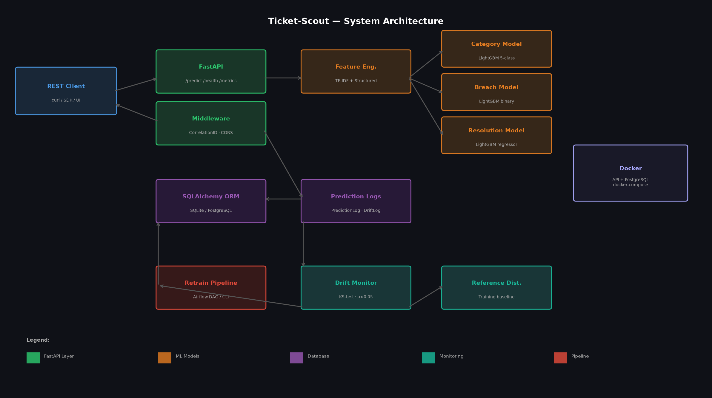

# Ticket-Scout

[](https://github.com/atharvadevne123/Ticket-Scout/actions/workflows/ci.yml)
[](https://python.org)
[](https://fastapi.tiangolo.com)
[](https://lightgbm.readthedocs.io)

**Intelligent IT support ticket triage API.** Auto-classifies issue type, predicts SLA breach risk, and estimates resolution time using a LightGBM ensemble with TF-IDF NLP features and real-time drift monitoring.

---

## Features

| Feature | Detail |
|---------|--------|
| Category classification | 5 classes: access, email, hardware, network, software |
| SLA breach prediction | Binary classifier with breach probability score |
| Resolution estimation | Hours-to-resolve regression |
| Drift detection | KS-test on 4 key feature distributions |
| Batch inference | Up to 50 tickets per request |
| Auto-retraining | Airflow DAG + standalone pipeline |
| Observability | Correlation IDs, structured logging, prediction DB |

---

## Architecture



---

## Quick Start

```bash
git clone https://github.com/atharvadevne123/Ticket-Scout
cd Ticket-Scout
cp .env.example .env
pip install -r requirements.txt
uvicorn app.main:app --reload
```

Visit `http://localhost:8000/docs` for the interactive API docs.

### Docker

```bash
docker-compose up --build
```

---

## API Reference

### `POST /api/v1/predict`

Triage a single ticket.

```json
{
  "subject": "VPN not connecting after update",
  "body": "My VPN drops every 30 minutes blocking all remote work.",
  "priority": "high",
  "created_hour": 9,
  "created_dow": 1,
  "org_size": 500
}
```

**Response:**

```json
{
  "ticket_id": "uuid",
  "predicted_category": "network",
  "confidence": 0.89,
  "sla_breach_prob": 0.72,
  "resolution_hours_pred": 3.8,
  "risk_level": "high"
}
```

### `POST /api/v1/predict/batch`

Batch triage (max 50 tickets).

### `GET /api/v1/health`

Service health and uptime.

### `GET /api/v1/metrics`

Model performance metrics and 24h prediction stats.

### `POST /api/v1/drift`

Trigger a KS-test drift check against the 24h prediction window.

### `POST /api/v1/retrain`

Trigger model retraining (demo endpoint).

---

## Running Tests

```bash
make test
# or
DATABASE_URL=sqlite:///./test.db MODEL_DIR=./test_models pytest tests/ -v
```

---

## Tech Stack

- **Python 3.11** + **FastAPI** + **Pydantic v2**
- **LightGBM** ensemble (classifier + classifier + regressor)
- **scikit-learn** Pipeline + TF-IDF + StandardScaler
- **SQLAlchemy 2** (SQLite dev / PostgreSQL prod)
- **scipy** KS-test drift detection
- **Docker** + **docker-compose** + **PostgreSQL**
- **Airflow** DAG for nightly retraining
- **GitHub Actions** CI (ruff + pytest)
