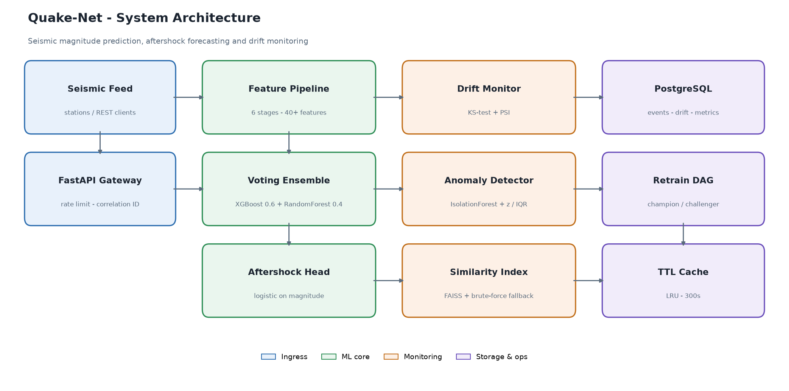

# Quake-Net

[](https://github.com/atharvadevne123/reflective-lantern/actions/workflows/quake-net-ci.yml)
[](https://www.python.org/downloads/)
[](LICENSE)

Seismic event magnitude prediction and aftershock forecasting API. An XGBoost + RandomForest
voting ensemble estimates local magnitude from waveform amplitudes, focal depth, station
geometry and fault mechanism, then derives an aftershock probability from the predicted
magnitude. Predictions are logged to PostgreSQL and continuously monitored for feature drift.



## Table of contents

- [What it does](#what-it-does)
- [Quick start](#quick-start)
- [API reference](#api-reference)
- [Architecture](#architecture)
- [Model](#model)
- [Monitoring](#monitoring)
- [Testing](#testing)
- [Configuration](#configuration)

## What it does

A seismic network records an event and produces raw observables — P- and S-wave peak
amplitudes, focal depth, epicentral distance, how many stations picked it up, and the
inferred fault mechanism. Quake-Net turns those observables into:

| Output | Description |
| --- | --- |
| `predicted_magnitude` | Local magnitude estimate, clipped to a physical 0.1–9.9 range |
| `aftershock_probability` | Logistic function of predicted magnitude, centred at M5.0 |
| `magnitude_class` | USGS-style band: micro / minor / light / moderate / strong / major / great |

Around that core it ships the operational machinery a model needs to stay trustworthy in
production: drift detection, anomaly scoring, similarity lookup against historical events,
and a champion/challenger retraining pipeline.

## Quick start

### Local

```bash
git clone https://github.com/atharvadevne123/reflective-lantern.git
cd reflective-lantern/quake-net

python3 -m venv .venv && source .venv/bin/activate
make install

cp .env.example .env        # adjust DATABASE_URL if not using SQLite
make train                  # trains the ensemble, writes model.joblib + metrics.json
make run                    # serves on http://localhost:8000
```

Interactive OpenAPI docs are at <http://localhost:8000/docs>.

### Docker

```bash
docker compose up --build
```

This starts the API on port 8000 alongside a PostgreSQL 16 instance. The API container waits
for the database healthcheck before booting and runs as a non-root user.

### First request

```bash
curl -X POST http://localhost:8000/api/v1/predict \
  -H 'Content-Type: application/json' \
  -d '{
    "latitude": 35.6,
    "longitude": 139.7,
    "depth_km": 20.0,
    "station_count": 12,
    "p_wave_amplitude": 4.1,
    "s_wave_amplitude": 7.8,
    "epicentral_distance_km": 100.0,
    "fault_type": "reverse"
  }'
```

```json
{
  "predicted_magnitude": 5.31,
  "aftershock_probability": 0.6786,
  "magnitude_class": "moderate",
  "model_version": "1.0.0",
  "correlation_id": "0f9c1e6a-..."
}
```

## API reference

All routes are versioned under `/api/v1`.

| Method | Endpoint | Purpose |
| --- | --- | --- |
| `GET` | `/api/v1/health` | Liveness, model and database status, uptime |
| `POST` | `/api/v1/predict` | Score a single seismic event |
| `POST` | `/api/v1/predict/batch` | Score up to 100 events in one call |
| `POST` | `/api/v1/forecast/aftershocks` | Omori-law aftershock sequence forecast |
| `GET` | `/api/v1/metrics` | Service counters and champion model metrics |
| `GET` | `/api/v1/drift` | Per-feature KS-test drift report |
| `GET` | `/api/v1/drift/psi` | Population Stability Index per feature |
| `POST` | `/api/v1/similar` | Nearest historical events by seismic signature |
| `GET` | `/api/v1/anomalies` | Isolation Forest + z-score + IQR outlier flags |
| `GET` | `/api/v1/events/recent` | Most recently logged predictions |
| `GET` | `/api/v1/cache/stats` | TTL cache utilisation and hit rate |

### Request schema

`POST /api/v1/predict` validates every field with Pydantic:

| Field | Type | Constraint |
| --- | --- | --- |
| `latitude` | float | −90 to 90 |
| `longitude` | float | −180 to 180 |
| `depth_km` | float | > 0, ≤ 700 |
| `station_count` | int | 1 to 500 |
| `p_wave_amplitude` | float | > 0 |
| `s_wave_amplitude` | float | > 0, and ≥ half the P-wave amplitude |
| `epicentral_distance_km` | float | > 0, ≤ 20000 |
| `fault_type` | str | `strike_slip` \| `reverse` \| `normal` \| `oblique` \| `unknown` |

The S-wave cross-field check catches transposed or mis-parsed amplitude pairs: S-waves
carry more energy than P-waves at the same source, so an S amplitude below half the P
amplitude almost always signals a data error rather than a real event.

### Aftershock forecasting

`POST /api/v1/forecast/aftershocks` projects the aftershock sequence following a mainshock
using the modified Omori law, `n(t) = K / (t + c)^p`:

```bash
curl -X POST http://localhost:8000/api/v1/forecast/aftershocks \
  -H 'Content-Type: application/json' \
  -d '{"mainshock_magnitude": 6.8, "horizon_days": 7}'
```

Each day in the horizon comes back with an expected event count and the probability of at
least one aftershock, alongside the fitted Omori parameters, the rate half-life, and the
largest expected aftershock magnitude from Bath's law (mainshock − 1.2).

Supplying `observed_times_days` — the times in days of aftershocks already recorded — fits
`K` and `p` to that sequence by maximum likelihood over a grid of decay exponents instead
of deriving them from magnitude alone, which sharpens the forecast considerably once a
sequence is underway.

### Response headers

Every response carries `X-Correlation-ID` (echoed from the request when supplied, otherwise
generated) and `X-Response-Time-Ms`. Both are emitted in the structured JSON access log.

## Architecture

```
Client ─▶ FastAPI gateway ─▶ Feature pipeline ─▶ Voting ensemble ─▶ Aftershock head
             │                                          │
             │ rate limit, correlation ID               ▼
             │                                    PostgreSQL (events)
             ▼                                          │
        Drift monitor ◀── prediction store ◀────────────┘
             │
             ▼
       Retrain DAG (champion / challenger)
```

The feature pipeline is a six-stage sklearn `Pipeline`, fitted and serialised together with
the model so training and serving cannot diverge:

1. **GeoFeatureEngineer** — seismic moment proxies, S/P amplitude ratio, depth-corrected
   amplitudes, station density, total waveform energy.
2. **FaultTypeEncoder** — ordinal seismicity score plus one-hot columns per mechanism.
3. **LagRollingFeatures** — rolling mean/std over 3-, 5- and 10-event windows plus two lags,
   capturing sequence context in aftershock series.
4. **DropCategoricalColumns** — drops non-numeric residue by dtype check.
5. **InfinityNaNFixer** — replaces ±inf with NaN, then imputes fitted column medians.
6. **StandardScaler** — zero-mean, unit-variance scaling.

Eight raw columns expand to 47 engineered features.

## Model

A `VotingRegressor` blending two learners with complementary failure modes:

| Estimator | Weight | Configuration |
| --- | --- | --- |
| XGBoost | 0.6 | 200 trees, depth 5, lr 0.05, subsample 0.8 |
| RandomForest | 0.4 | 150 trees, depth 8, min_samples_leaf 3 |

Training reports 5-fold cross-validated R², plus held-out RMSE, MAE and R² on a 20% split.
Metrics land in `metrics.json` and the `model_metrics` table.

Measured on 3,000 synthetic events (`make train`):

| Metric | Value |
| --- | --- |
| CV R² (5-fold) | 0.8216 ± 0.0211 |
| Held-out R² | 0.8029 |
| RMSE | 0.2642 magnitude units |
| MAE | 0.2080 magnitude units |
| Engineered features | 47 (from 8 raw columns) |

An RMSE of 0.26 means typical predictions land within about a quarter of a magnitude unit
of the target — inside the spread between independent agencies' published magnitudes for
the same real event.

**On the training data.** No proprietary seismic catalogue ships with this repository.
`make_synthetic_dataset` generates events from a Richter-like relationship — magnitude as a
function of log amplitudes, depth attenuation, fault seismicity and station count — with
Gaussian noise keeping the problem non-separable. Metrics therefore describe the model's
ability to recover a known physical relationship, not its accuracy on real catalogue data.
Point `train_model` at a real DataFrame with the same columns to train on genuine events.

## Monitoring

**Drift.** Each numeric feature of each prediction goes into a bounded in-memory window
(200 samples by default). `GET /api/v1/drift` runs a two-sample Kolmogorov–Smirnov test of
that window against the stored reference distribution and writes results to `drift_logs`.
A p-value below 0.05 flags drift. `GET /api/v1/drift/psi` computes the Population Stability
Index over the same pairs — PSI catches gradual shifts in distribution shape that KS can
miss on smaller windows.

**Anomalies.** `GET /api/v1/anomalies` scores recent events three ways: an Isolation Forest
over the five-column signature, a z-score rule, and a Tukey IQR fence. An event flagged by
any of the three is returned with all three verdicts, so a reviewer can see whether the
signal is multivariate or driven by one extreme value.

`GET /api/v1/health` reports `status: degraded` rather than failing when the model or
database is unavailable — the process is alive and can still serve cached reads, so a load
balancer should keep it in rotation while the alert fires.

**Retraining.** `pipelines/retrain_dag.py` runs weekly (Mondays 02:00 UTC under Airflow, or
via `run_retraining_pipeline()` standalone): check drift, load fresh data, train a
challenger, then gate it. The challenger is promoted only if it beats the incumbent's R²
*and* clears an absolute floor of 0.70. The champion's metrics are read **before** training
begins — otherwise the challenger would be compared against its own freshly written metrics
and every model, including regressions, would promote. A rejected run restores the
champion's `metrics.json`.

## Testing

```bash
make test                       # full suite with coverage
pytest tests/ -m "not slow"     # skip the end-to-end retraining test
pytest tests/test_model.py -v   # a single module
```

293 tests across twelve modules cover feature transforms, model training and prediction
bounds, drift and PSI maths, the similarity index, anomaly rules, Omori forecasting,
input validation, cache eviction and TTL expiry, database round-trips, the retraining
gate, and every API route. Database tests run
in a transaction that is rolled back per test, so they neither leak state nor require a
live PostgreSQL.

## Configuration

| Variable | Default | Description |
| --- | --- | --- |
| `DATABASE_URL` | `sqlite:///./quake_net.db` | SQLAlchemy URL; use PostgreSQL in production |
| `MODEL_PATH` | `model.joblib` | Serialised pipeline location |
| `METRICS_PATH` | `metrics.json` | Champion metrics location |
| `REFERENCE_PATH` | `reference_dist.json` | Reference distribution for drift tests |
| `DRIFT_WINDOW` | `200` | Samples retained per feature for drift checks |
| `DRIFT_ALPHA` | `0.05` | KS-test significance threshold |
| `FAISS_INDEX_PATH` | `seismic_index.faiss` | Persisted similarity index |
| `LOG_LEVEL` | `INFO` | Root log level |

FAISS is optional. When it is not installed, the similarity index falls back to an exact
brute-force NumPy search with identical results — slower on large corpora, but never a
startup failure. Index persistence is opt-in (`build(..., persist=True)`) so an ad-hoc
query cannot overwrite the index the API is serving from.

## License

MIT — see [LICENSE](LICENSE).
