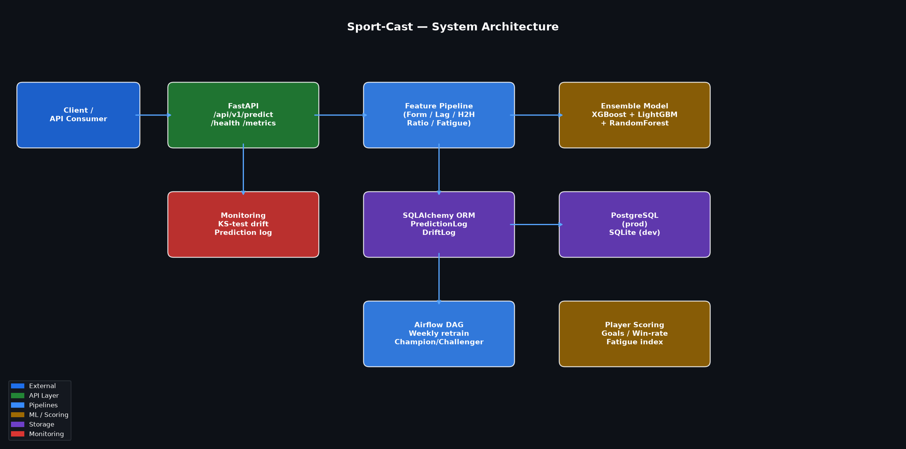

# Sport-Cast

> Sports match outcome prediction and player performance scoring API using XGBoost + LightGBM + RandomForest ensemble with 7-stage feature engineering, KS-drift monitoring, champion/challenger retraining, and PostgreSQL-backed prediction logging.

[](../../actions/workflows/sport-cast-ci.yml)


## Overview

Sport-Cast predicts the outcome of sports matches (home win / draw / away win) from team form, head-to-head history, Elo ratings, goals averages, and player fatigue indices. It also scores individual player performance for squad-selection and transfer-analysis workflows.

**What it does:**
- Predict match outcomes with calibrated 3-class probabilities
- Score player performance from goals, assists, win-rate, and injury history
- Detect feature drift with KS-test and PSI between reference and live distributions
- Log every prediction to a persistent database for audit and retraining
- Run automated weekly champion/challenger retraining via an Airflow DAG

## Quick Start

```bash
git clone https://github.com/atharvadevne123/reflective-lantern
cd reflective-lantern/sport-cast
pip install -r requirements.txt
uvicorn app.main:app --reload
```

Visit `http://localhost:8000/docs` for the interactive API explorer.

### Docker

```bash
docker-compose up --build
```

## API Reference

| Endpoint | Method | Description |
|---|---|---|
| `/api/v1/health` | GET | Health check |
| `/api/v1/predict` | POST | Predict match outcome |
| `/api/v1/players/score` | POST | Score player performance |
| `/api/v1/metrics` | GET | Prediction count metrics |
| `/api/v1/drift` | POST | KS-test drift check |
| `/api/v1/drift/summary` | GET | Drift history |
| `/api/v1/predictions/history` | GET | Recent predictions |

### Example: Predict a match

```bash
curl -X POST http://localhost:8000/api/v1/predict \
  -H "Content-Type: application/json" \
  -d '{
    "home_team": "Arsenal",
    "away_team": "Chelsea",
    "home_wins_last5": 3, "home_draws_last5": 1, "home_losses_last5": 1,
    "away_wins_last5": 2, "away_draws_last5": 1, "away_losses_last5": 2,
    "home_goals_avg": 2.1, "home_goals_conceded_avg": 0.9,
    "away_goals_avg": 1.7, "away_goals_conceded_avg": 1.2,
    "home_elo": 1780.0, "away_elo": 1720.0,
    "home_days_rest": 7, "away_days_rest": 5,
    "home_is_home_ground": 1.0
  }'
```

Response:
```json
{
  "predicted_outcome": "home_win",
  "home_win_prob": 0.5812,
  "draw_prob": 0.2440,
  "away_win_prob": 0.1748,
  "confidence": 0.5812,
  "latency_ms": 4.3
}
```

## Architecture



## Tech Stack

| Component | Technology |
|---|---|
| API | FastAPI + Pydantic v2 |
| ML | XGBoost + LightGBM + RandomForest VotingClassifier |
| Feature pipeline | sklearn Pipeline (7 stages, 30+ features) |
| Drift detection | KS-test + PSI |
| Database | SQLAlchemy ORM / SQLite (dev) / PostgreSQL (prod) |
| Migrations | Alembic |
| Orchestration | Airflow champion/challenger DAG |
| Observability | Structured JSON logging + correlation IDs |
| Tests | pytest (43 tests, 5 modules) |
| CI | GitHub Actions (ruff + pytest 3.11/3.12) |
| Container | Docker + docker-compose |

## Feature Pipeline

The 7-stage pipeline transforms raw match data into 30+ model features:

1. **FormEncoder** — win-rate, unbeaten-rate, momentum from last 5 results
2. **LagRollingTransformer** — goal differentials, attack/defense strength
3. **HeadToHeadTransformer** — H2H win-rates and home-advantage delta
4. **RatioFeatureTransformer** — ranking diff, Elo diff, expected win probability
5. **FatigueTransformer** — exponential decay from days since last match
6. **DropCategoricalTransformer** — removes non-numeric columns
7. **StandardScaler** — zero-mean unit-variance normalisation

## Setup

```bash
cp .env.example .env
# Edit .env with your DATABASE_URL
make install
make test
make run
```

## Retraining

The Airflow DAG `sport_cast_retrain` runs every Monday at 03:00 UTC:

1. Fetches fresh training data
2. Trains a challenger model (5-fold CV)
3. Promotes only if AUC ≥ champion AUC (champion/challenger gate)
4. Validates AUC ≥ 0.60 before deployment
