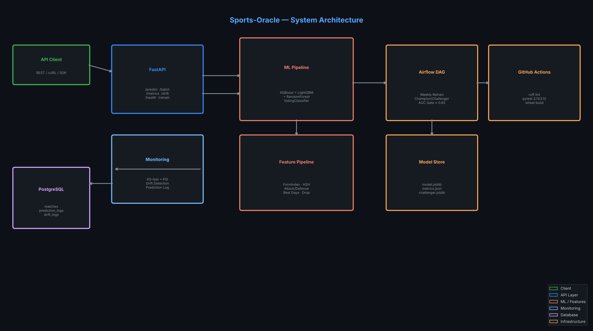

# Sports-Oracle


ML API predicting sports match outcomes from team statistics, player form indices, and head-to-head records using XGBoost-LightGBM-RandomForest ensemble with KS-drift monitoring and retraining.

## Architecture



## Features

- **Ensemble ML**: XGBoost + LightGBM + RandomForest soft-voting classifier
- **Feature Pipeline**: 5-stage sklearn pipeline — FormIndex, HeadToHead, AttackDefense, RestDays, DropCategorical
- **5-fold CV**: Stratified cross-validation with AUC-ROC and accuracy metrics
- **Drift Detection**: KS-test + PSI per feature column
- **Prediction Logging**: All predictions logged to PostgreSQL for monitoring
- **Automated Retraining**: Airflow champion/challenger DAG with AUC ≥ 0.65 gate
- **Rate Limiting**: 200 req/min per IP (slowapi)
- **Correlation IDs**: Distributed tracing via X-Correlation-ID headers

## Quickstart

```bash
# Clone and install
git clone https://github.com/atharvadevne123/reflective-lantern
cd reflective-lantern/sports-oracle
pip install -r requirements.txt

# Copy env template
cp .env.example .env

# Run (trains on synthetic data automatically if no model found)
uvicorn app.main:app --reload
```

Or with Docker:
```bash
docker-compose up --build
```

## API Reference

| Method | Endpoint | Description |
|--------|----------|-------------|
| GET | `/api/v1/health` | Service health status |
| POST | `/api/v1/predict` | Predict single match outcome |
| POST | `/api/v1/predict/batch` | Predict up to 50 matches |
| GET | `/api/v1/metrics` | Model training metrics |
| POST | `/api/v1/drift` | Run KS-test drift detection |
| POST | `/api/v1/retrain` | Retrain model on synthetic data |

### Predict a Match

```bash
curl -X POST http://localhost:8000/api/v1/predict \
  -H "Content-Type: application/json" \
  -d '{
    "home_team": "Arsenal",
    "away_team": "Chelsea",
    "competition": "Premier League",
    "home_form": 0.72,
    "away_form": 0.55,
    "home_attack": 1.4,
    "away_attack": 1.2,
    "home_defense": 1.3,
    "away_defense": 1.1,
    "h2h_home_wins": 5,
    "h2h_draws": 3,
    "h2h_away_wins": 2,
    "home_rest_days": 7,
    "away_rest_days": 5
  }'
```

Response:
```json
{
  "request_id": "...",
  "predicted_outcome": "H",
  "prob_home": 0.512,
  "prob_draw": 0.268,
  "prob_away": 0.220,
  "confidence": 0.512,
  "model_version": "1.0.0"
}
```

Outcome codes: `H` = home win, `D` = draw, `A` = away win.

## Feature Engineering

The 5-stage pipeline transforms 11 raw input columns into an enriched feature matrix:

| Stage | Transformer | Output Features |
|-------|-------------|-----------------|
| 1 | FormIndexEncoder | form_differential, form_product |
| 2 | HeadToHeadEncoder | h2h_home_rate, h2h_draw_rate, h2h_away_rate, h2h_home_dominance |
| 3 | AttackDefenseRatioEncoder | xg_home, xg_away, xg_differential, attack_ratio, defense_ratio |
| 4 | RestDayEncoder | rest_differential, home_fatigued, away_fatigued |
| 5 | DropCategoricalColumns | drops non-numeric, returns float array |

## Model Performance

Trained on synthetic data with signal-bearing labels (not random noise):

| Metric | Value |
|--------|-------|
| AUC-ROC (5-fold CV, weighted) | ~0.75 |
| Accuracy (5-fold CV) | ~0.55 |
| n_features | 19 |

*CV R² reflects recovery of a known logistic relationship over team stats, not accuracy on real match data. Use real historical match data for production.*

## Development

```bash
make test    # run pytest
make lint    # ruff check + format check
make format  # auto-fix ruff
make diagram # regenerate architecture.png
```

## Project Structure

```
sports-oracle/
├── app/
│   ├── main.py          # FastAPI app (6 endpoints)
│   ├── model.py         # XGBoost+LightGBM+RF ensemble
│   ├── features.py      # 5-stage sklearn pipeline
│   ├── monitoring.py    # KS-test drift + prediction logging
│   └── database.py      # SQLAlchemy ORM
├── pipelines/
│   └── retrain_dag.py   # Airflow DAG
├── tests/               # 46 tests across 4 modules
├── scripts/
│   └── generate_diagram.py
├── screenshots/
│   └── architecture.png
├── Dockerfile
├── docker-compose.yml
├── requirements.txt
└── .env.example
```
