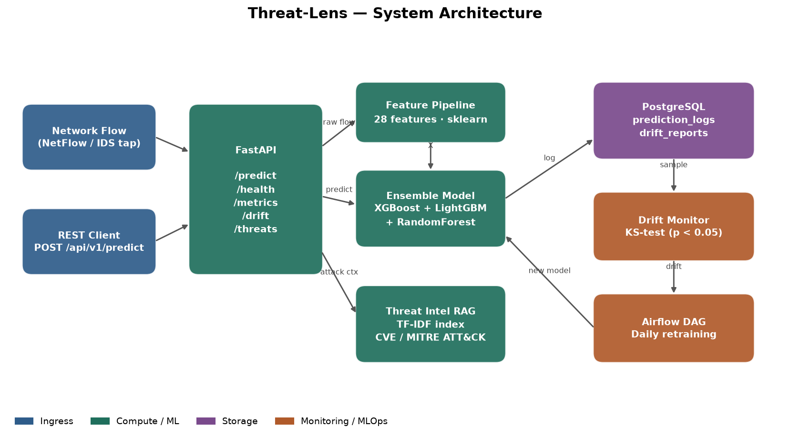

# Threat-Lens

Network intrusion detection API that classifies network flows as benign or as one of
four attack families, and attaches CVE / MITRE ATT&CK context to every detection.

[](https://github.com/atharvadevne123/reflective-lantern/actions)


---

## What it does

`POST` a network flow record and Threat-Lens returns the predicted class, a calibrated
confidence score, the full class-probability distribution, and — when the flow is judged
malicious — the threat-intelligence entry that best matches the detected behaviour.

```bash
curl -X POST localhost:8000/api/v1/predict \
  -H 'Content-Type: application/json' \
  -d '{"src_bytes":20,"dst_bytes":0,"flag":"S0","count":480,
       "serror_rate":0.95,"dst_host_count":250}'
```

```json
{
  "correlation_id": "5e314dda-ab54-4b31-aad2-80a6b506d5e9",
  "predicted_class": "dos",
  "is_attack": true,
  "confidence": 0.8846,
  "class_probabilities": {
    "normal": 0.0003, "dos": 0.8846, "probe": 0.0605,
    "r2l": 0.0375, "u2r": 0.0171
  },
  "threat_context": "Network Denial of Service (T1498): Flooding a target to degrade
                     availability. Characterised by very high connection count,
                     near-zero dst_bytes and high serror_rate. Maps to DoS class."
}
```

### Attack taxonomy

| Class    | Meaning                | Typical signature                                  |
|----------|------------------------|----------------------------------------------------|
| `normal` | Benign traffic         | Balanced byte ratio, `SF` flag, low error rates     |
| `dos`    | Denial of service      | Very high `count`, near-zero `dst_bytes`, `S0`/`REJ`|
| `probe`  | Reconnaissance / scan  | High `diff_srv_rate`, many hosts, short connections |
| `r2l`    | Remote-to-local        | Repeated `num_failed_logins` on `telnet`/`ftp`      |
| `u2r`    | Privilege escalation   | Elevated `hot` and `num_compromised` counters       |

---

## Architecture



A request flows through five stages:

1. **FastAPI** validates the flow against a Pydantic schema (422 on bad input) and
   stamps a correlation ID onto the request and response.
2. **Feature pipeline** turns 23 raw flow fields into 28 numeric features, including
   derived signals — `bytes_ratio`, `bytes_per_second`, `error_rate_combined`,
   `connection_density`, and a service-risk encoding.
3. **Ensemble model** — soft-voting XGBoost + LightGBM + RandomForest, wrapped in an
   sklearn `Pipeline` behind a `StandardScaler`.
4. **Threat-intel RAG** retrieves the closest CVE / MITRE ATT&CK entry by TF-IDF cosine
   similarity whenever the flow is classified as an attack.
5. **Monitoring** logs every prediction to PostgreSQL and runs a two-sample KS test
   against a rolling reference window; an Airflow DAG retrains nightly on drift.

---

## Setup

### Local

```bash
pip install -r requirements.txt
make train        # fits the ensemble and writes model.joblib + metrics.json
make run          # serves on http://localhost:8000
```

Interactive API docs are at `http://localhost:8000/docs`.

### Docker

```bash
cp .env.example .env
docker compose up --build
```

This starts the API on `:8000` and PostgreSQL on `:5432`. The image trains a model
during build, so the container is ready to serve as soon as it is healthy.

---

## API reference

All endpoints are versioned under `/api/v1`.

| Method | Path                | Purpose                                             |
|--------|---------------------|-----------------------------------------------------|
| `GET`  | `/api/v1/health`    | Liveness probe; reports whether the model is loaded  |
| `POST` | `/api/v1/predict`   | Classify a single network flow                       |
| `GET`  | `/api/v1/metrics`   | Training metrics, live drift results, prediction count |
| `GET`  | `/api/v1/drift`     | Recent KS-test drift reports (`?limit=`)             |
| `GET`  | `/api/v1/threats`   | Search threat intel corpus (`?q=`, `?top_k=`)        |

Every response carries `X-Correlation-ID` and `X-Response-Time-Ms` headers. Pass your
own `X-Correlation-ID` on the request to trace a call through the logs.

### Request fields

The 23 accepted fields mirror the KDD-style connection record — `duration`, `src_bytes`,
`dst_bytes`, `protocol_type`, `service`, `flag`, `count`, `serror_rate`,
`dst_host_count`, and so on. Every field has a default, so a partial flow is valid;
`protocol_type` is constrained to `tcp` / `udp` / `icmp`.

---

## Monitoring and retraining

Predictions land in `prediction_logs`. `run_full_drift_check` compares the recent window
against a reference distribution with a two-sample Kolmogorov–Smirnov test and writes a
row to `drift_reports` per feature, flagging drift at `p < 0.05`.

`pipelines/retrain_dag.py` runs daily at 02:00 UTC: check drift → collect new samples →
retrain if drift was detected or ≥200 new samples accumulated, recording each run in
`retraining_events`. The module also exposes `run_retraining_pipeline()` so the same
logic runs without an Airflow scheduler present.

---

## A note on the reported accuracy

The bundled model trains on a **synthetic** dataset generated by
`generate_synthetic_dataset`, whose five classes are drawn from deliberately
well-separated distributions. Cross-validated accuracy comes out at ~1.0, which measures
the separability of that generator — **not** real-world detection performance. Point the
training routine at labelled capture data (NSL-KDD, CIC-IDS2017, or your own NetFlow
exports) before reading anything into the number.

---

## Development

```bash
make test     # 50 tests across API, model, features, and monitoring
make lint     # ruff
make format   # ruff --fix
```

CI runs ruff and the full pytest suite on every push and pull request touching
`threat-lens/`.

---

## Tech stack

Python 3.11 · FastAPI · Pydantic v2 · scikit-learn · XGBoost · LightGBM · SciPy ·
SQLAlchemy 2 · PostgreSQL · Alembic · Airflow · Docker Compose · pytest · ruff ·
GitHub Actions

## License

MIT — see [LICENSE](LICENSE).
