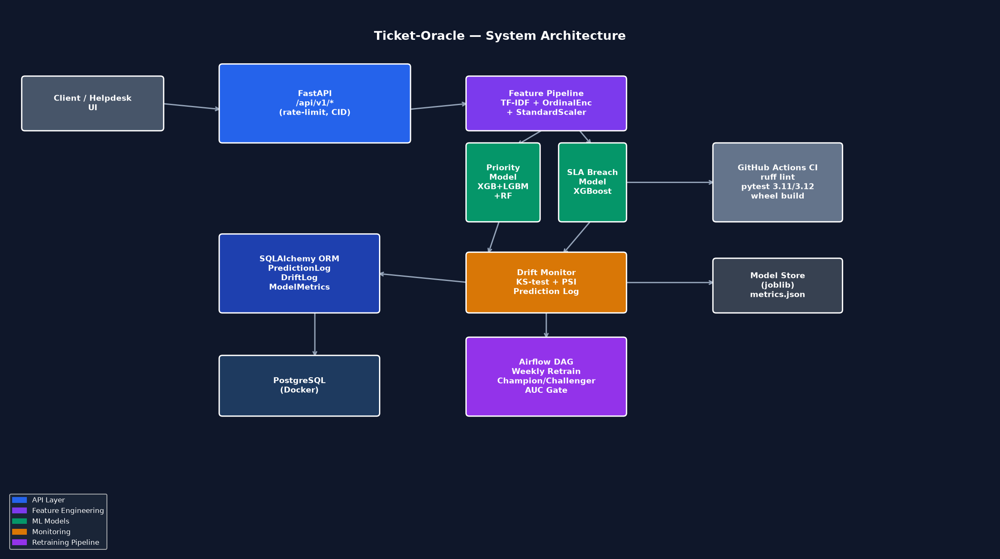

# Ticket-Oracle

**IT helpdesk ticket priority classification and SLA breach prediction API** using XGBoost-LightGBM-RandomForest ensemble with NLP text features, workload lag metrics, and automated drift monitoring.


---

## Overview

Ticket-Oracle ingests an IT support ticket and returns:

| Output | Description |
|--------|-------------|
| **Priority** | P1 (Critical) / P2 (High) / P3 (Medium) / P4 (Low) |
| **Priority probabilities** | Per-class softmax probabilities from the VotingClassifier |
| **SLA breach risk** | Probability the ticket will breach its SLA (0–1) |
| **Estimated resolution hours** | Expected time to resolve based on priority + workload |
| **Confidence** | Max priority-class probability |

### Architecture



---

## Tech Stack

| Layer | Tools |
|-------|-------|
| API | FastAPI, Pydantic v2, slowapi rate-limiting |
| ML Models | XGBoost + LightGBM + RandomForest VotingClassifier (priority), XGBoost (SLA breach) |
| Feature Pipeline | sklearn ColumnTransformer: TF-IDF (80 terms), OrdinalEncoder, StandardScaler |
| Evaluation | 5-fold Stratified CV, weighted OvR AUC-ROC |
| Monitoring | KS-test + PSI drift detection, prediction logging |
| Persistence | SQLAlchemy ORM, PostgreSQL (prod) / SQLite (dev) |
| Retraining | Airflow weekly DAG, champion/challenger AUC gate |
| Infrastructure | Docker, docker-compose |
| Quality | pytest (90+ tests), ruff lint, GitHub Actions CI |

---

## Setup

### Local (development)

```bash
# 1. Install dependencies
pip install -r requirements.txt

# 2. Copy and edit environment variables
cp .env.example .env

# 3. Start the API (auto-trains on first run)
make run
```

### Docker (production)

```bash
docker-compose up --build
```

The API will be available at `http://localhost:8000`.  
Swagger docs: `http://localhost:8000/api/v1/docs`

---

## API Reference

### `POST /api/v1/predict`

Predict ticket priority and SLA breach risk.

**Request body:**

```json
{
  "ticket_id": "T-12345",
  "description": "VPN connectivity failure affecting Engineering remote workers after Windows update",
  "department": "Engineering",
  "incident_type": "Network",
  "channel": "email",
  "customer_tier": "Gold",
  "product_area": "Infrastructure",
  "open_tickets_count": 45,
  "agent_load": 8,
  "hour_of_day": 14,
  "day_of_week": 1,
  "day_of_month": 15,
  "ticket_age_minutes": 30.0,
  "same_user_last_7d": 2
}
```

**Response:**

```json
{
  "ticket_id": "T-12345",
  "priority": "P2",
  "priority_probabilities": {"P1": 0.15, "P2": 0.62, "P3": 0.18, "P4": 0.05},
  "sla_breach_risk": 0.73,
  "sla_breach_predicted": true,
  "estimated_resolution_hours": 5.5,
  "confidence": 0.62,
  "model_version": "1.0.0"
}
```

### `POST /api/v1/predict/batch`

Batch prediction for up to 50 tickets at once.

### `GET /api/v1/health`

API liveness check and model status.

### `GET /api/v1/metrics`

Current model CV AUC-ROC metrics from the last training run.

### `GET /api/v1/drift`

KS-test + PSI drift detection on recent prediction distributions.

### `POST /api/v1/train`

Trigger model retraining on fresh synthetic data.

### `GET /api/v1/predictions`

Recent prediction history (default 100, max 500).

---

## Priority Mapping

| Priority | SLA Target | Typical Scenarios |
|----------|-----------|-------------------|
| P1 — Critical | 1 hour | Security breach, full outage, Gold-tier customer |
| P2 — High | 4 hours | Network failure, application down, key service degraded |
| P3 — Medium | 24 hours | Partial impact, workaround exists |
| P4 — Low | 72 hours | How-to requests, service requests, minor issues |

---

## Feature Engineering

The sklearn ColumnTransformer extracts three feature groups:

1. **TF-IDF text features** — 80 terms with bigrams from ticket description
2. **Ordinal-encoded categoricals** — department, incident_type, channel, customer_tier, product_area
3. **Scaled numeric workload metrics** — open_tickets_count, agent_load, hour_of_day, day_of_week, is_weekend, is_month_end, ticket_age_minutes, same_user_last_7d

---

## Drift Detection

`GET /api/v1/drift` runs a KS-test and PSI check on the last 500 prediction SLA breach risk scores against the training reference distribution.

- **KS p-value < 0.05** → drift detected
- **PSI > 0.2** → significant population shift

Both results are persisted to the `drift_logs` table.

---

## Retraining

The Airflow DAG `ticket_oracle_weekly_retrain` runs every Monday at 02:00 UTC:

1. Generate 2 000 synthetic tickets
2. Train challenger model (XGBoost + LightGBM + RF)
3. Gate promotion: challenger AUC ≥ max(0.70, champion AUC)
4. Promote or restore champion

---

## Development

```bash
make test    # run pytest suite
make lint    # ruff check
make format  # ruff format --fix
make train   # train on synthetic data locally
```

---

## License

MIT — see [LICENSE](LICENSE).
