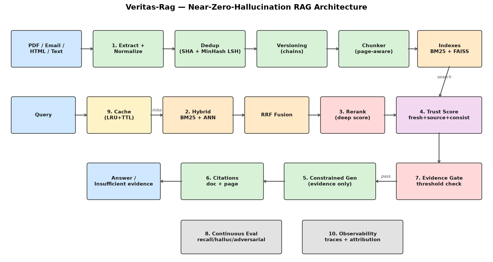

# Veritas-Rag


**A RAG system designed for 10 million documents and near-zero hallucinations.** Ten explicit stages, each testable and traceable: if Veritas-Rag answers, every claim is cited to a document and page; if the evidence isn't strong enough, it says *insufficient evidence* instead of guessing.

## The ten stages

| # | Stage | What it does | Where |
|---|---|---|---|
| 1 | **Ingestion & normalization** | PDF / email / HTML / text extraction, unicode+whitespace normalization, exact (SHA-256) and near-duplicate (MinHash+LSH) removal, per-source version chains | `app/ingestion/` |
| 2 | **Hybrid retrieval** | BM25 keyword matching *and* semantic vector search — exact terms and meaning both count | `app/retrieval/bm25.py`, `embedder.py` |
| 3 | **ANN + reranking** | FAISS IVF approximate search for millisecond recall over millions of chunks, then a deep cross-scorer over the fused shortlist | `app/retrieval/ann.py`, `rerank.py` |
| 4 | **Confidence scoring** | Per-chunk trust = freshness + source quality + retrieval consistency (agreement between independent retrievers) | `app/scoring/trust.py` |
| 5 | **Constrained generation** | The generator may only use retrieved evidence — no assumptions, no model world-knowledge | `app/generation/` |
| 6 | **Citation-backed outputs** | Every claim maps to chunk → document → page | `app/generation/extractive.py`, `llm.py` |
| 7 | **Hallucination fallback** | Below the confidence threshold the system answers "insufficient evidence" — never a guess | `app/generation/fallback.py` |
| 8 | **Continuous evaluation** | Recall tests, hallucination tests on unanswerable questions, adversarial prompts (injection, false presuppositions) — CI-gated | `app/evaluation/` |
| 9 | **Caching** | LRU+TTL cache over normalized queries; the hot head of power-law traffic skips retrieval entirely | `app/caching.py` |
| 10 | **Observability** | Full per-request traces: chunk rankings, retrieval path, trust breakdowns, gate reasons, token attribution, stage latencies | `app/observability.py` |

## Quick start

```bash
cd veritas-rag
make install        # pip install -r requirements.txt
make test           # 108 tests
make demo           # ingest a corpus, ask questions, print a trace
make eval           # the stage-8 evaluation suite (CI gate)
make run            # API on :8000 → /docs
```

### Docker

```bash
docker compose up -d --build
```

## API

```bash
# Ingest (base64-encoded bytes; type detected from the extension)
curl -X POST localhost:8000/api/v1/ingest -H 'Content-Type: application/json' -d '{
  "source": "policy.txt",
  "content_base64": "'"$(echo 'The rebate pays 900 dollars per kilowatt.' | base64 -w0)"'"
}'

# Query
curl -X POST localhost:8000/api/v1/query -H 'Content-Type: application/json' \
  -d '{"question": "How much does the rebate pay per kilowatt?"}'
```

Response — answered, with claim-level citations:

```json
{
  "request_id": "6f1c...",
  "answered": true,
  "confidence": 0.71,
  "answer": "The rebate pays 900 dollars per kilowatt.",
  "citations": [
    {"claim": "The rebate pays 900 dollars per kilowatt.",
     "chunk_id": "doc-8c1...-v1:1:0", "doc_id": "doc-8c1...-v1",
     "source": "policy.txt", "page": 1,
     "quote": "The rebate pays 900 dollars per kilowatt."}
  ]
}
```

Response — evidence too weak (the hallucination fallback):

```json
{
  "answered": false,
  "confidence": 0.21,
  "answer": "Insufficient evidence: the indexed documents do not contain enough reliable information to answer this question.",
  "citations": []
}
```

Other endpoints: `GET /api/v1/health`, `GET /api/v1/metrics` (index sizes, cache hit rate), `GET /api/v1/trace/{request_id}` (the full stage-10 trace), `GET /api/v1/traces`.

## How hallucinations are prevented

Four independent layers, each of which alone reduces hallucination — together they make an ungrounded confident answer structurally hard:

1. **Retrieval consistency in the trust score** — a chunk found by only one retriever at a low rank is down-weighted; spurious matches rarely survive both BM25 *and* semantic search plus the reranker.
2. **The evidence gate runs before generation** — weak evidence short-circuits into the fallback; the generator never sees it.
3. **The generator is constrained** — the extractive backend copies evidence sentences verbatim (hallucination structurally impossible); the Anthropic backend runs under a grounding contract with native claim-level citations and a mandated `INSUFFICIENT EVIDENCE` escape hatch.
4. **An empty/ungrounded generation also falls back** — even past the gate, a generator that can't ground an answer produces the insufficient-evidence response, never prose.

The stage-8 suite (`make eval`) verifies all four layers continuously: hallucination rate on unanswerable questions must be 0.0 and the adversarial pass rate 1.0, or CI fails.

## Generator backends

| Backend | Property | Use |
|---|---|---|
| `extractive` (default) | Zero hallucination *by construction* — answers are verbatim evidence sentences | dev, CI, air-gapped |
| `anthropic` | Fluent abstractive answers under the same grounding contract, with API-native citations (`claude-opus-4-8`) | production |

Switch with `GENERATOR_BACKEND=anthropic` + `ANTHROPIC_API_KEY` (see `.env.example`).

## Scaling to 10M documents

The in-process components are interface-compatible stand-ins for distributed backends: BM25 → OpenSearch/Tantivy, hashed embeddings → neural embedding service, FAISS-IVF in-process → FAISS/HNSW service, dict-based dedup → KV store, in-memory cache → Redis. The pipeline logic — fusion, trust, gating, citations, tracing — does not change. The full scaling story, stage by stage, is in [docs/ARCHITECTURE.md](docs/ARCHITECTURE.md).



## Project layout

```
veritas-rag/
├── app/
│   ├── ingestion/       # stage 1: extractors, normalize, dedup, chunker, versioning
│   ├── retrieval/       # stages 2-3: bm25, embedder, ann (FAISS), hybrid RRF, rerank
│   ├── scoring/         # stage 4: trust
│   ├── generation/      # stages 5-7: prompts, extractive, llm (Anthropic), fallback
│   ├── evaluation/      # stage 8: harness, adversarial suite
│   ├── caching.py       # stage 9
│   ├── observability.py # stage 10
│   ├── pipeline.py      # orchestrator
│   └── main.py          # FastAPI
├── tests/               # 108 tests across every stage
├── scripts/             # demo.py, run_eval.py, generate_diagram.py
└── docs/ARCHITECTURE.md # the 10M-document scaling story
```

## License

MIT
